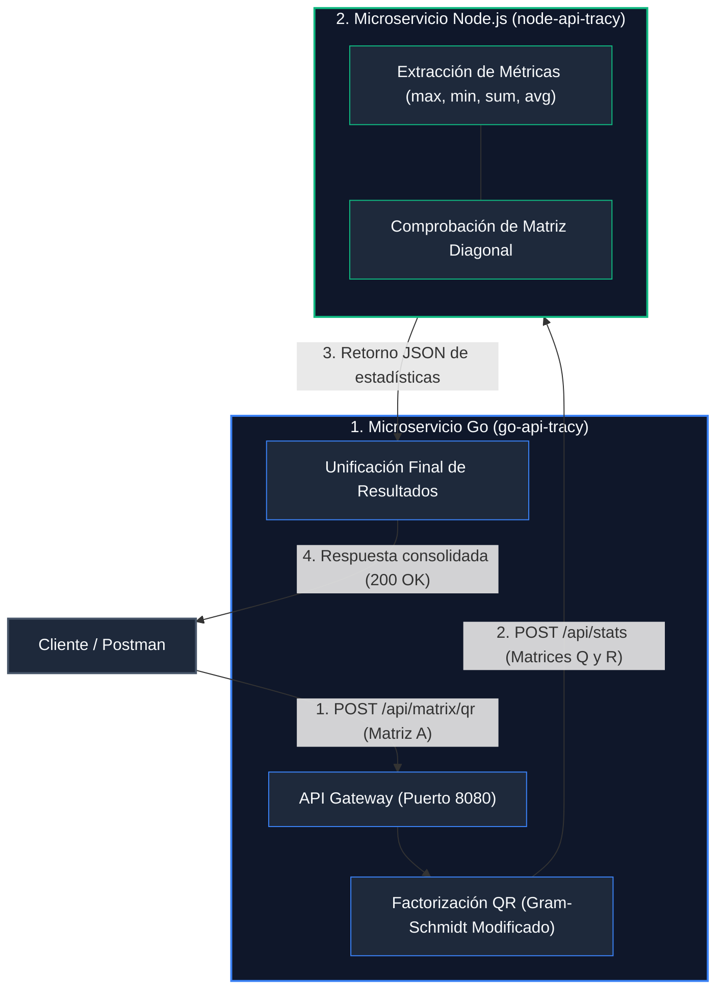

# Tracy Moriano - Challenge - Factorización QR y Estadísticas Matriciales

Solución técnica distribuida compuesta por dos microservicios comunicados vía HTTP para el procesamiento algebraico de matrices y extracción de métricas estadísticas.

---

## 🚀 Despliegue en la Nube (Producción en Render)

Los servicios se encuentran desplegados y listos para pruebas públicas:

- **API Principal (Go + Fiber):** https://go-api-tracy.onrender.com
- **API Analítica (Node.js + Express):** https://node-api-tracy.onrender.com

---

## Arquitectura del Sistema

El sistema implementa una separación de responsabilidades (Separation of Concerns):



## Endpoints y Pruebas Técnicas

### 1. Factorización QR y Estadísticas Consolidadas (Go Service)
Procesa la matriz rectangular, calcula la descomposición $A = Q \cdot R$ y retorna el análisis estadístico consolidado.

- **Método:** POST
- **URL (Producción):** https://go-api-tracy.onrender.com/api/matrix/qr
- **URL (Local):** http://localhost:8080/api/matrix/qr
- **Headers:** Content-Type: application/json

#### Request Body:
```json
{
  "matrix": [
    [1, 2],
    [3, 4],
    [5, 6]
  ]
}
```

#### Response Body (200 OK):
```json
{
  "q": [
    [0.169031, 0.897085],
    [0.507093, 0.276026],
    [0.845154, -0.345033]
  ],
  "r": [
    [5.916080, 7.437357],
    [0.000000, 0.828079]
  ],
  "stats": [
    {
      "matrix_index": 0,
      "max": 0.897085,
      "min": -0.345033,
      "sum": 2.350325,
      "avg": 0.391721,
      "is_diagonal": false
    },
    {
      "matrix_index": 1,
      "max": 7.437357,
      "min": 0,
      "sum": 14.181516,
      "avg": 3.545379,
      "is_diagonal": false
    }
  ]
}
```

### 2. Extracción Estadística Directa (Node.js Service)
Permite procesar directamente una lista de matrices para obtener sus indicadores.

- **Método:** POST
- **URL (Producción):** https://node-api-tracy.onrender.com/api/stats
- **URL (Local):** http://localhost:3000/api/stats
- **Headers:** Content-Type: application/json

#### Request Body:
```json
{
  "matrices": [
    [
      [2, 0],
      [0, 5]
    ]
  ]
}
```

#### Response Body (200 OK):
```json
{
  "stats": [
    {
      "matrix_index": 0,
      "max": 5,
      "min": 0,
      "sum": 7,
      "avg": 1.75,
      "is_diagonal": true
    }
  ]
}
```

---

## Ejecución Local con Docker

### Prerrequisitos
Docker Desktop instalado y en ejecución.

### Instrucciones
1. Clonar el repositorio:
```bash
git clone https://github.com/TracyMooor/tracy-moriano-challenge.git
cd tracy-moriano-challenge
```

2. Levantar los microservicios en segundo plano:
```bash
docker compose up -d --build
```

3. Detener los servicios:
```bash
docker compose down
```

---

## Conclusión de la Solución

### 1. ¿Cuál es el problema que resuelven?
El proyecto resuelve la necesidad de descomponer una matriz de datos y extraer indicadores estadísticos de forma distribuida. En lugar de procesar todo en un solo programa, divide el trabajo pesado (álgebra lineal) del análisis de datos (estadísticas) en dos servicios especializados.

### 2. ¿Qué hace cada API?
- **API 1: Go + Fiber (Procesamiento Matemático)**
  Actúa como la puerta de entrada principal del sistema (API Gateway).
  Recibe una tabla de números (matriz rectangular) enviada por el usuario.
  Aplica la Factorización QR mediante Gram-Schmidt, descomponiendo la matriz original en dos matrices nuevas: $Q$ (ortogonal) y $R$ (triangular superior).
  Envía las matrices resultantes a la API de Node.js y entrega el resultado consolidado al usuario final.

- **API 2: Node.js + Express (Análisis Estadístico)**
  Opera en segundo plano como un microservicio de soporte analítico.
  Recibe las matrices calculadas ($Q$ y $R$).
  Recorre todos los números y calcula cinco métricas concretas: valor máximo, valor mínimo, suma total, promedio y verificación de matriz diagonal.
  Devuelve el reporte estadístico estructurado en formato JSON.

### 3. ¿Cómo se conectan entre sí?
Se comunican a través de la red usando el protocolo HTTP bajo el estándar JSON mediante el siguiente flujo secuencial:

- El usuario envía una petición POST al servicio Go en el puerto 8080 con su matriz de entrada.
- Go procesa la factorización QR y, a través de un cliente HTTP interno, despacha una petición POST hacia Node.js en el puerto 3000 (`http://node-service:3000/api/stats` en local o su URL HTTPS en Render `https://node-api-tracy.onrender.com/api/stats`).
- Node.js procesa las métricas solicitadas y responde síncronamente a Go con un payload JSON.
- Go une las matrices ($Q$ y $R$) junto con las estadísticas recibidas y retorna la respuesta unificada final (200 OK) al usuario.